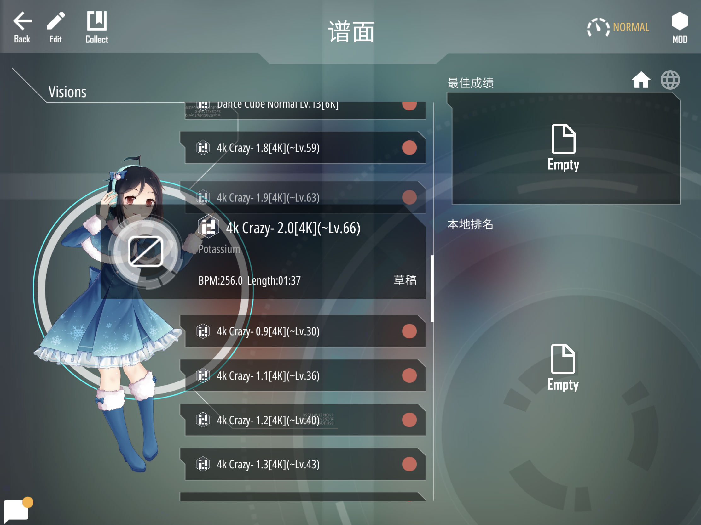

# Malody Beatmap Speed Changer
Malody谱面调速器。

## windows下载链接
链接：https://pan.baidu.com/s/1OiAhw0WEm3F8appouSkxgw 
提取码：2bbs

操作视频：[https://www.bilibili.com/video/av86027458](https://www.bilibili.com/video/av86027458)

## 谱面展示
通过本软件，可以生成各种速度的Malody谱面。


## 安装运行步骤
### 安装Python3
去[Python官网](https://www.python.org/downloads/)下载安装Python3，并添加到Path

### 安装依赖
```
pip3 install -r requirements.txt 
```


### 启动运行
运行main.py
```
python3 main.py
```
然后打开[http://localhost:4776](http://localhost:4776)就可以看到以下界面：


## 其他速度
修改speeds.txt即可。最大速度为2.0，最慢速度为0.5。精确到千分位，比如0.6955速度会转换为0.695。
